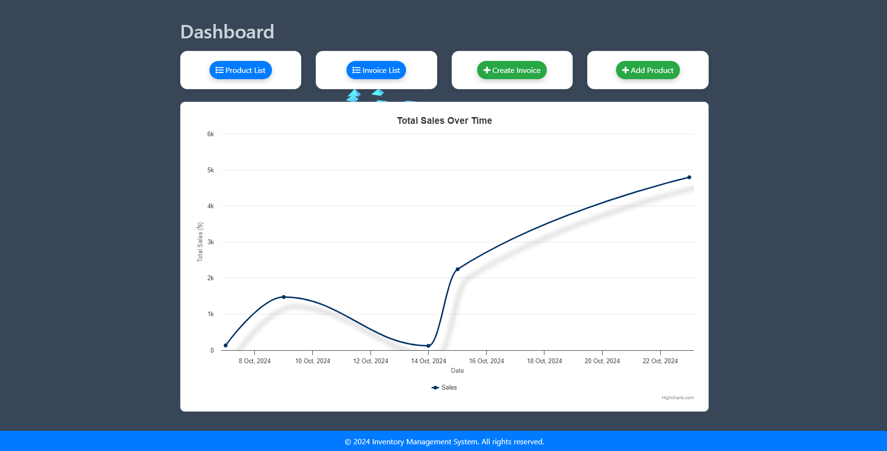
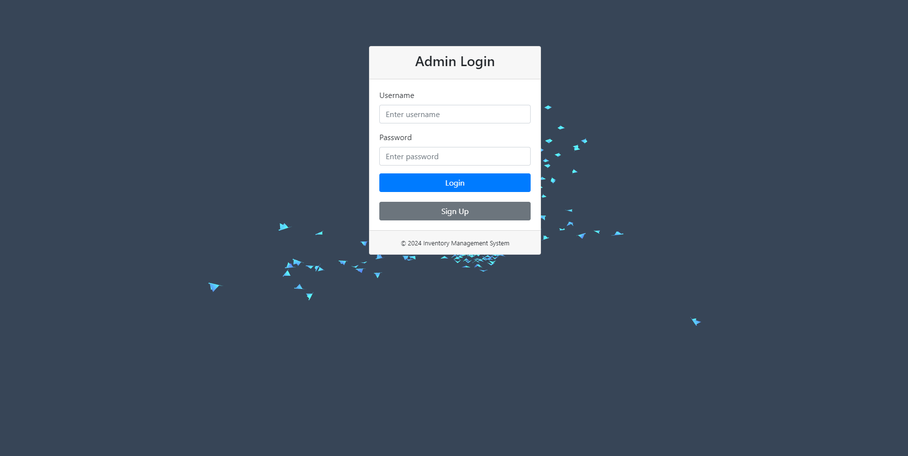
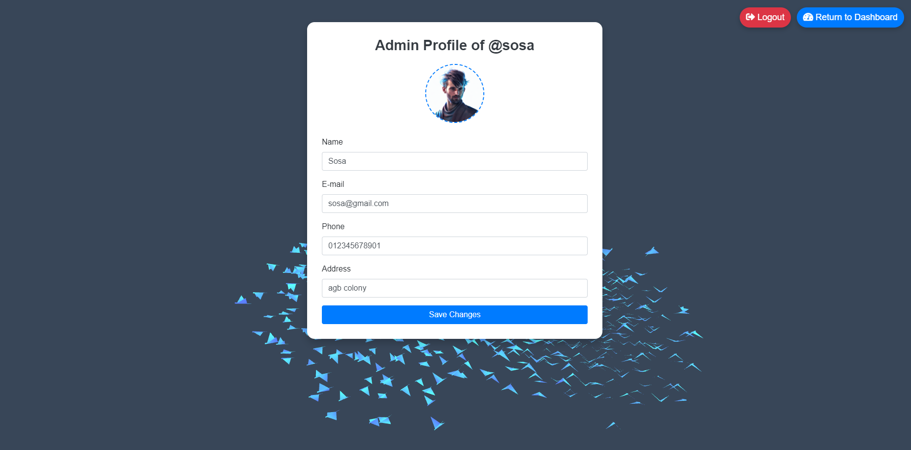
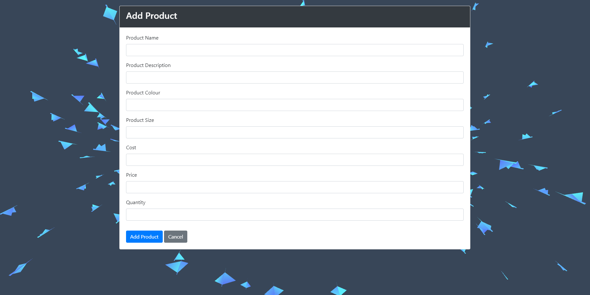
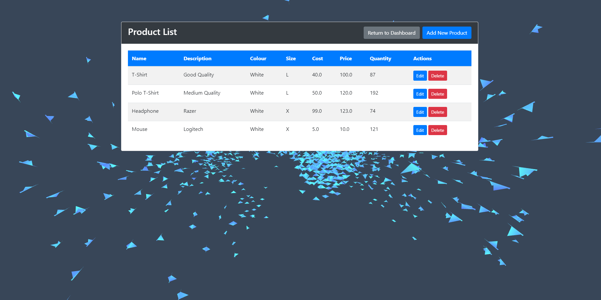
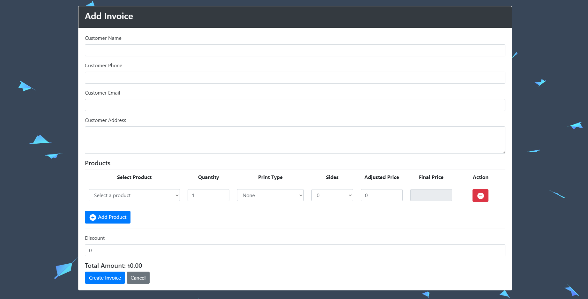
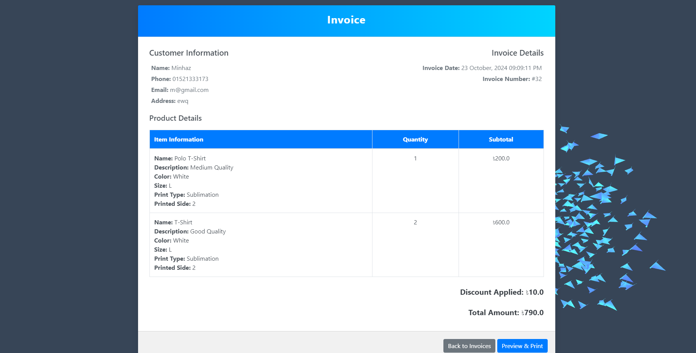
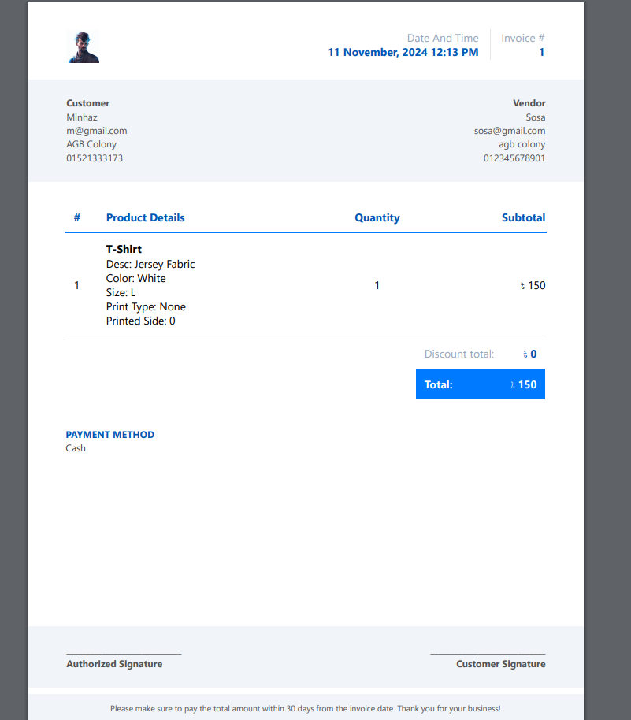
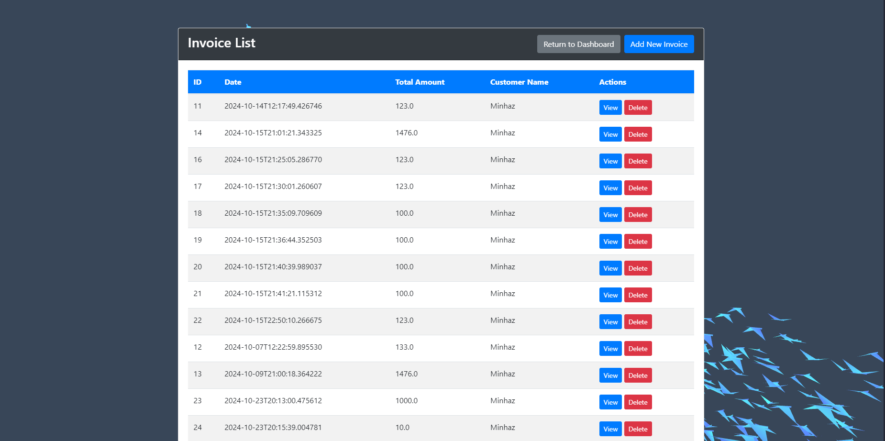

# **Inventory Management Web App**

This is a Spring Boot-based Inventory Management System which is created to manage product inventories, create and print invoices, view analytics on sales data. This project is specially designed for products which can be customized by printing.

## Features

* Admin Login: Signup, Login functionalities with Spring Security
* Product Management: Add, update, delete, and list products.
* Inventory Tracking: View Product stocks.
* Sales Management: Analytics on sales.
* Invoice Management: Create and Print Invoices

## Screenshots

## Tech Stack

* Backend: Spring Boot, Spring Data JPA
* Database: PostgreSQL
* Frontend: Thymeleaf, Bootstrap 

## Docker Setup
1. In the project directory, execute the following command to build the docker container and images:
`docker-compose build`
2. execute `docker-compose up` to run the project

## Contact

For any questions or feedback, please contact [mminhazurrahman0@gmail.com]().

